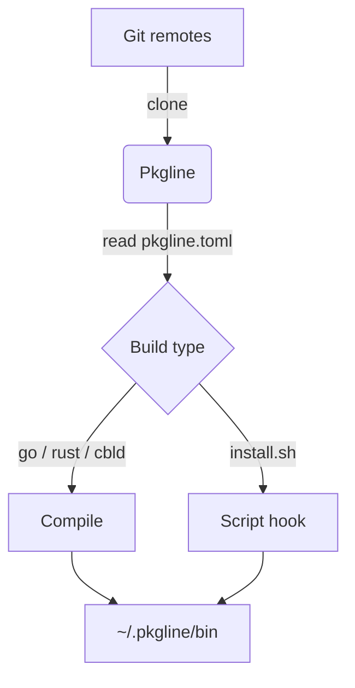

# Overview

Pkgline is a user-space package manager for Linux and macOS. It installs developer tools directly from git repositories without needing `sudo`.

## Why Pkgline?

- **No sudo:** Binaries go into `~/.pkgline/bin` (add it to your `PATH`).
- **Git-first:** Clone from GitHub shorthand (`gh:user/repo`), full Git URLs, or local directories.
- **Native builds:** Go (`go build`), Rust (`cargo build --release`), and cbld/C/C++ (`cbld build`).
- **Script fallback:** Repos can ship `install.sh` / `uninstall.sh` hooks in `pkgline.toml`.

## Architecture

